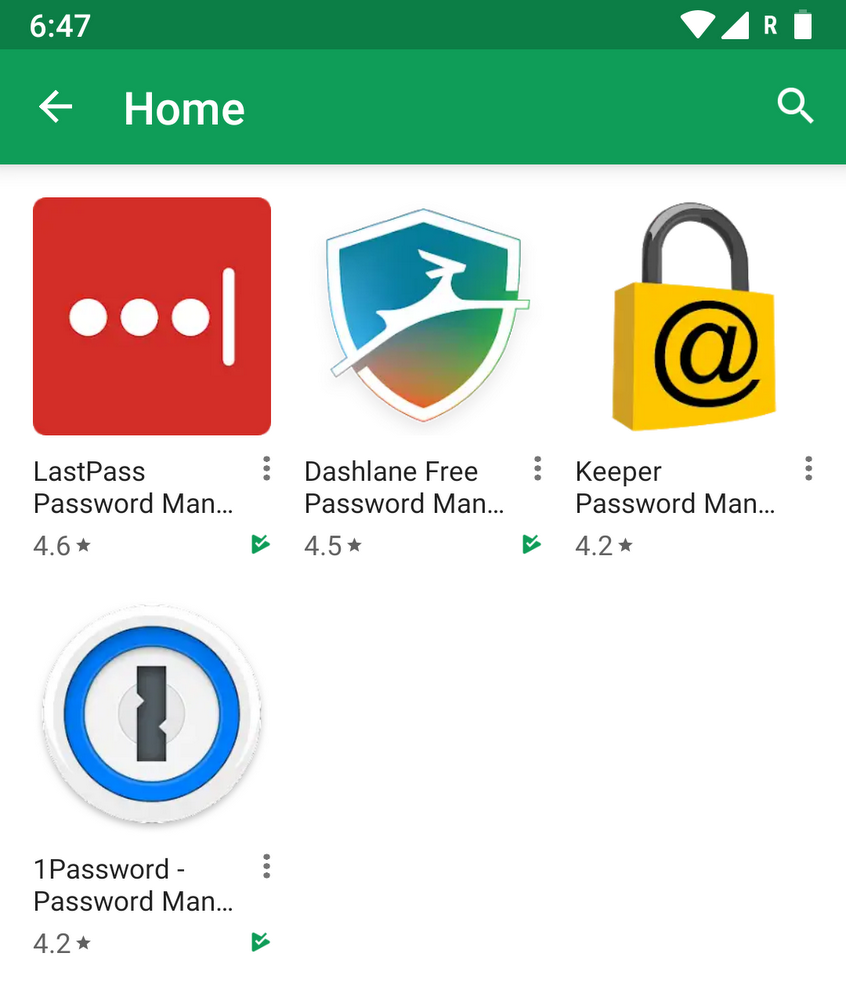
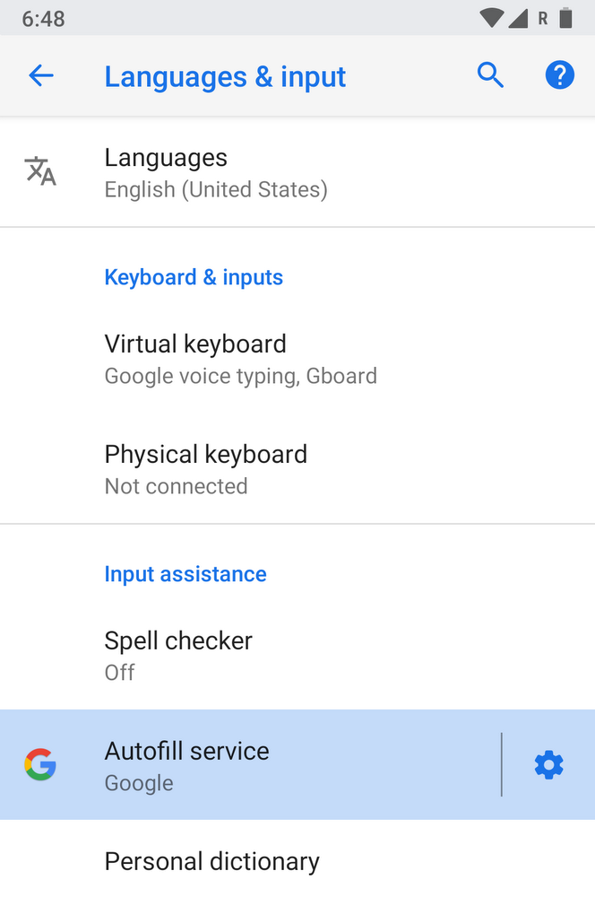
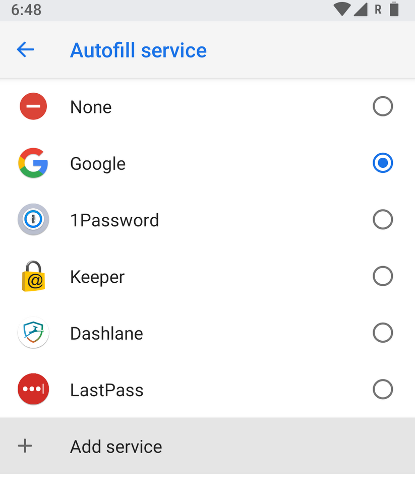

[Original Address](https://www.blog.google/products/android/use-your-favorite-password-manager-android-oreo/)

# Use your favorite password manager with Android Oreo

- **Peter Friese**(Developer Advocate)
- Published Apr 13, 2018

Security experts recommend strong, unique passwords for each service that you use. For most of us, however, it can be difficult to manage credentials across multiple websites and apps, especially if you’re trying to keep track of everything in your head.

In Android 8.0 Oreo, we made it simpler to use Autofill with a password manager, like LastPass, Dashlane, Keeper, or 1Password. Particularly on tiny devices like your phone, autofill can make your life easier by remembering things (with your permission), so that you don’t have to type out your name, address, or credit card over and over again.

With the new autofill services in Oreo, password managers can access only the information that’s required in order to autofill apps, making your data more secure. There’s a specific list of password managers (which you can find in Android Settings) that meet our security and functional requirements, and we'll be continuing to grow this list over time. If you already use a password manager, then you’ll be able to try the new experience today.

## How does it work?

Setting up Autofill on your device is easy. Simply go to Settings, search for “Autofill,” and tap “Autofill service.” If you already have a password manager installed, it will show up in this list. You can also tap “Add service” to download the password manager of your choice from the Play Store.

Once you’ve set a password manager as your Autofill service, the information stored in that app will show up in Autofill whenever you fill out forms (for example, your saved username and password will show up as a suggestion when you’re logging into an app for the first time).

We include Google as an autofill service on all devices running Android 8.0 and above, which lets you use data that you already have saved in Chrome to fill in passwords, credit cards, addresses, and other personal information.

Whether you use Google or another password manager from the Play Store, the new Autofill experience on Oreo makes it easier to securely store and recall commonly typed information, like passwords and credit card numbers.
