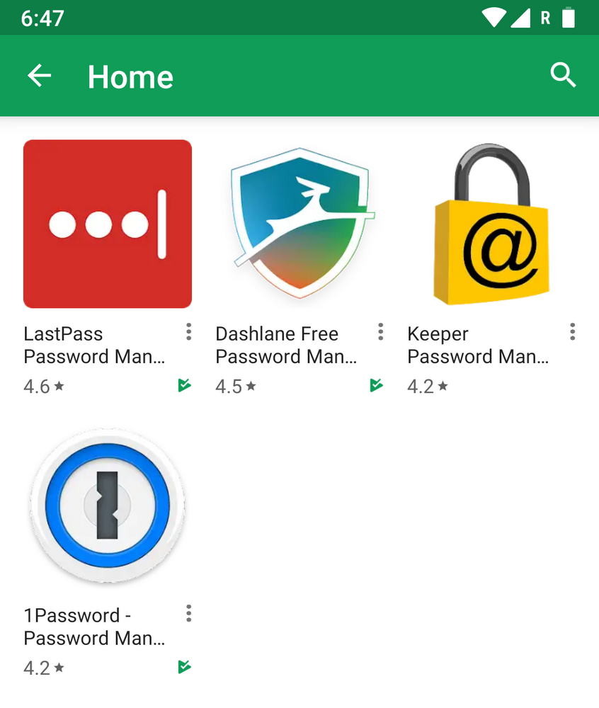
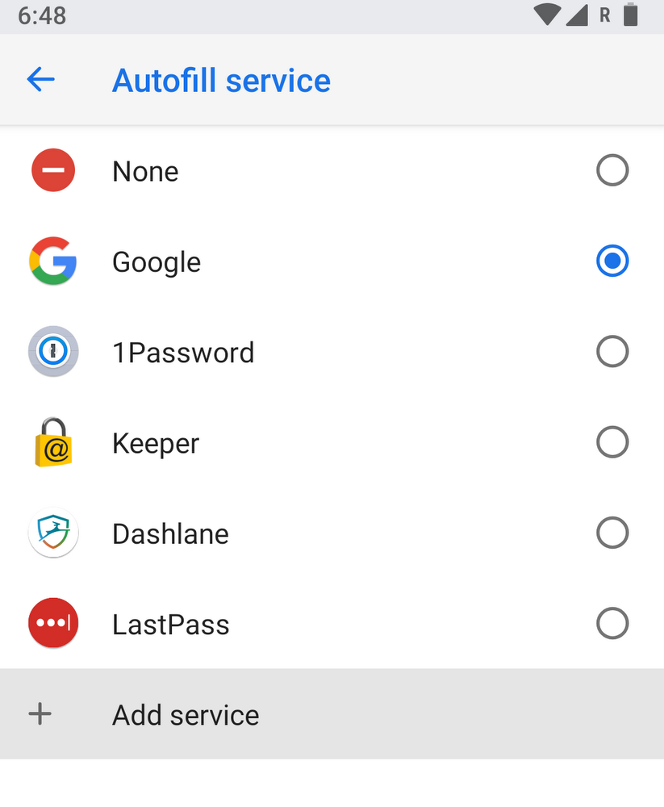

# 在Android O上使用你最喜欢的密码管理器

- Author：**Peter Friese**(Developer Advocate)
- Translator：**Robbort**
- 翻译于 Apr 13, 2018

安全专家为你所使用的每项服务推荐强大，独特的密码。 然而，对于我们大多数人来说，在多个网站和app里去管理凭据会感到困难，尤其是当你尝试去记住你脑海中的每一项内容的时候。

在 Android 8.0中，我们使其更简单地使用**自动填充**（Autofill）和密码管理器（像LastPass，Dashlane，Keeper或1Password等）。特别是在像你的手机等小设备上，**自动填充**（Autofill）可以通过记住事情（经你的许可）让你的生活更轻松，这样你就不必一遍又一遍地输入自己的姓名，地址或信用卡。

借助Oreo中的新**自动填充**服务，密码管理器只能访问所需的信息，以便自动填充应用，从而使你的数据更安全。 有一个特定的密码管理器列表（你可以在Android设置中找到）来满足我们的安全性和功能要求，并且随着时间的推移，我们将继续增加此列表。 如果你已经使用密码管理器，那么你今天就可以尝试新的体验。

## 它是如何工作的？

在你的设备上设置**自动填充**很容易。 只需进入设置，搜索“**自动填充**”，然后点击“**自动填充服务**”。如果你已经安装了密码管理器，它将显示在此列表中。 你还可以点击“添加服务”从Play商店下载你选择的密码管理器。

一旦你将密码管理器设置为自动填充服务，每当你填写表单时，存储在该应用中的信息都会显示在自动填充中（例如，当你第一次登录app时，你保存的用户名和密码将作为建议显示出来）。

我们将Google作为自动填充服务包含在运行Android 8.0及更高版本的所有设备上，这样你就可以使用已保存在Chrome中的数据填写密码，信用卡，地址和其他个人信息。

无论你是使用Google还是Play商店的其他密码管理器，Oreo新的**自动填充**体验都可以更简单、安全地存储和调用常用输入的信息，例如密码和信用卡号码。

	如若此翻译侵权，请联系删除。